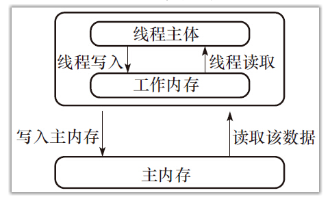
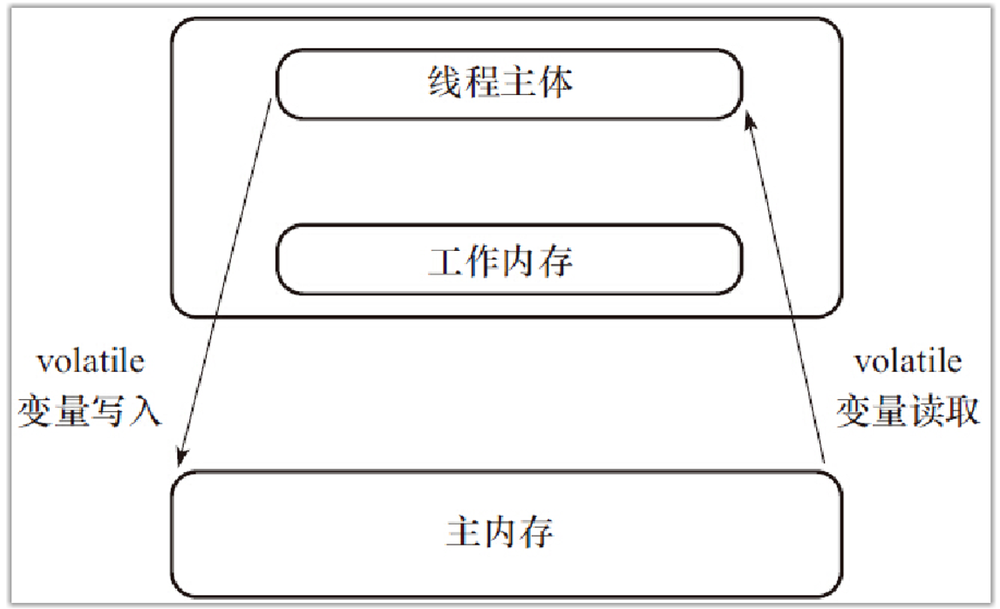

# 对象及变量的并发访问

应着重掌握的技术点

- synchronized对象监视器为Object时的作用
- synchronized对象监视器为Class时的使用
- 非线程安全是如何出现的
- 关键字volatile的主要作用
- 关键字volatile与synchronized的区别及使用情况

### synchronized同步方法

1. 方法内的变量为线程安全
2. 实例变量非线程安全

关键字synchronized取得的锁都是对象锁，而不是把一段代码或方法（函数）当作锁。只有共享资源的读写访问才需要同步化，如果不是共享资源，那么根本没有同步的必要。[示例1](synchronizedFunc/Run2.java) [示例2](lockObject/multiObject/Run.java)

#### synchronized 锁重入

关键字synchronized拥有锁重入的功能，也就是在使用synchronized时，当一个线程得到一个对象锁后，再次请求此对象锁时是可以再次得到该对象的锁的。当存在父子类继承关系时，子类是完全可以通过“可重入锁”调用父类的同步方法。

#### 出现异常，synchronized锁自动释放

#### 同步不具有继承性

#### synchronized同步代码块，同步方法

和synchronized方法一样，synchronized(this)代码块也是锁定当前对象的。

synchronized同步方法或synchronized(this)同步代码块分别有两种作用。

1. synchronized同步方法

   1）对其他synchronized同步方法或synchronized(this)同步代码块调用呈阻塞状态

   2）同一时间只有一个线程可以执行synchronized同步方法中的代码。

2. synchronized(this)同步代码块

   1）对其他synchronized同步方法或synchronized(this)同步代码块调用呈阻塞状态

   2）同一时间只有一个线程可以执行synchronized(this)同步代码块中的代码

3. synchronized(非this对象)

   1）在多个线程持有“对象监视器“为同一个对象的前提下，同一时间只有一个线程可以执行synchronized(非this对象x)同步代码块中的代码

   2）当持有“对象监视器”为同一个对象的前提下，同一时间只有一个线程可以执行synchronized(非this对象x)同步代码块中的代码

#### 静态同步synchronized方法与synchronized(class)代码块

关键字synchronized还可以应用在static静态方法上，如果这样写，那是对当前的*.java文件对应的Class类进行持锁。对象锁与Class锁执行结果异步。异步的原因是持有不同的锁，一个是对象锁，另外一个是Class锁，而Class锁可以对类的所有对象实例起作用。[示例](synchronizedClass/Run.java)

#### 多线程的死锁

因为不同的线程都在等待根本不可能被释放的锁，从而导致所有的任务都无法继续完成。

死锁的四个必要条件：

1）临界资源，互斥条件，一个资源每次只能被一个进程使用。

2）请求并保持条件，一个进程因请求资源而阻塞时，对已获得的资源保持不放。

3）不剥夺条件，进程已获得的资源，在未使用完之前，不能强行剥夺。

4）循环等待条件，若干进程之间形成一种头尾相接的循环等待资源关系。

#### 锁对象的改变

只要对象不变，即使对象的属性被改变，运行的结果还是同步的。

### volatile关键字

关键字volatile的主要作用是使变量在多个线程间可见。强制从公共堆栈中取得变量的值，而不是从线程私有数据栈中取得变量的值。

线程的私有堆栈

读取公共内存

线程安全的三大特性（原子性、可见性、有序性），volatile最致命的缺点是不支持原子性。[示例](volatileSync/Run.java)

synchronzied和volatile进行比较：

1）关键字volatile是线程同步的轻量级实现，所以volatile性能肯定比synchronized要好，而且volatile只能修饰于变量，而synchronized可以修饰方法，以及代码块。

2）多线程访问volaitle不会发生阻塞，而synchronized会出现阻塞

3）volatile能保证数据的可见性，但不能保证原子性；而synchronized可以保证原子性，也可以间接保证可见性，因为它会将私有内存和公共内存的数据做同步。[示例](volatileSync/visibility/Run.java)

4）再次重申一下，关键字volatile解决的是变量在多个线程之间的可见性；而synchronized关键字解决的是多个线程之间访问资源的同步性。

#### 原子类进行i++操作

ep:AtomicInteger.incrementAndGet()

#### synchronized代码块有volatile同步的功能

