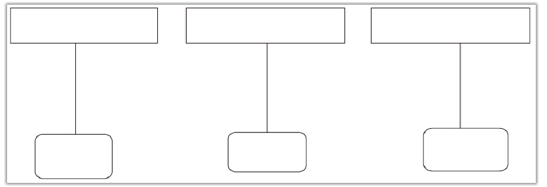

## Java Thread类核心API

#### 线程创建方式

1. 继承Thread类
2. 实现Runnable接口
3. Callable接口

注：Runnable接口实现与继承Thread类方式实现，自定义线程类中的实例变量针对其他线程可以有共享与不共享之分。

```java
public class MyThread extends Thread{
    private int count = 5;
    public MyThead(String name){
        super();
        this.setName(name);//设置线程名称
    }
    
    @Override
    public void run(){
        super.run();
        while(count > 0){
            count--;
            System.out.println("由"+this.currentThread().getName()
                               +" 计算，count="+count);
        }
    }
}
public class Run{
	public static void main(String[] args){
		MyThread a = new MyThread("A");
		MyThread b = new MyThread("B");
		MyThread c = new MyThread("C");
		a.start();
		b.start();
		c.start();
	}
}
```



<center>不共享数据</center>

```java
public class MyThread extends Thread{
    private int count = 5;
    //Thread(String name);
    //Thread(Runnable target);
	//Thread(Runnable target,String name);
    
    @Override
    public void run(){
        super.run();
        count--;
        System.out.println("由"+this.currentThread().getName()
                               +" 计算，count="+count);
    }
}
public class Run{
	public static void main(String[] args){
		MyThread a = new MyThread();
        Thread a = new Thread(mythread,"A");
        Thread b = new Thread(mythread,"B");
        Thread c = new Thread(mythread,"C");
        Thread d = new Thread(mythread,"D");
        Thread e = new Thread(mythread,"E");
		a.start();
		b.start();
		c.start();
        d.start();
        e.start();
	}
}
```


<center>共享数据</center>

结果相异说明：

1、因为Thread自身实现了Runnable接口，自身也是Runnable的实现类。只不过它自身的run()没有实际意义，只能转调用，构造函数中设置进来的另一个Runnable实现类的run()

2、但是如果是Thread的子类的话，会重写run()，并在其中实现业务代码。将父类的run()的跳转功能覆盖掉。


#### 停止线程

在Java中有以下3种方法可以终止正在运行的线程：

1. 使用退出标志，是线程正常退出，也就是当run方法完成后线程终止
2. 使用stop方法强行终止线程，但是**不推荐**使用这个方法，因为stop和suspend及resume一样，都是作废过期的方法，使用它们可能产生不可预料的结果
3. 使用interrupt方法中断线程

注：interrupt()方法的使用效果并不像for+break语句那样，马上就停止循环。调用interrupt()方法仅仅是在当前线程中打了一个停止的标记，并不是真的停止线程。

判断线程是否是停止状态，在Java的SDK中，Thread.java类里提供了两种方法。

1. this.interrupted()：测试当前线程是否已经中断（这里指的当前线程是当前正在执行的代码片段属于哪个线程）
2. this.isInterrupted()：测试线程是否已经中断（这里的线程是指调用方法的线程）

二者的区别详细可看[示例](stopThread/Run3.java)

通常判断停止状态的标志位在有循环的条件下可以break跳出循环，但并不能退出停止线程；通过判断线程停止状态的标志位，采用**抛异常**或**return**的方式来中断线程。[抛异常示例](stopThread/exception/Run6.java) [return示例](stopThread/returnThread/Run.java)

#### 暂停线程

在Java多线程中，可以使用suspend()方法暂停线程，使用resume()方法恢复线程的执行。**不推荐**，两个方法已经作废过期。[使用示例](suspendThread/Run.java)

suspend与resume方法的缺点——独占

在使用suspend与resume方法时，如果使用不当，极易造成公共的同步对象的独占，使得其他线程无法访问公共同步对象。

suspend与resume方法的缺点——不同步

在使用suspend与resume方法时也容易出现因为线程的暂停而导致数据不同步的情况。

#### 线程放弃CPU资源

yield()方法的作用是放弃当前的CPU资源，将它让给其他的任务去占用CPU执行时间。但放弃的时间不确定，有可能刚刚放弃，马上又获得CPU时间片。[示例](yield/Run.java)

#### 线程优先级

线程可以划分优先级，优先级较高的线程得到的CPU资源较多，也就是CPU优先执行优先级较高的线程对象中的任务。设置线程优先级使用setPriority()方法。

**线程优先级的继承特性**

比如A线程启动B线程，则B线程的优先级与A是一样的。

**线程优先级具有规则性**

**线程优先级具有随机性**

#### 守护线程

 Java线程中有两种线程： 用户线程，守护线程

 守护线程是一种特殊的线程，特性有陪伴的含义，当进程中不存在非守护线程了，则守护线程自动销毁。典型的守护线程就是垃圾回收线程，当进程中没有非守护线程了，则垃圾回收线程也就没有存在的必要了，自动销毁。守护线程的作用就是为其他线程的运行提供便利服务，最典型的应用就是GC(垃圾回收器)，它就是一个很称职的守护者。[示例](daemon/Run.java)


<center>表 Thread类常用方法摘要</center>

| 返回变量和类型   | 方法                            | 描述                                                         |
| ---------------- | ------------------------------- | ------------------------------------------------------------ |
| `long`           | `getId()`                       | 返回此Thread的标识符。                                       |
| `String`         | `getName()`                     | 返回此线程的名称。                                           |
| `void`           | `interrupt()`                   | 中断此线程。                                                 |
| `static boolean` | `interrupted()`                 | 测试当前线程是否已被中断，并清除线程的中断标志位                                   |
| `boolean`        | `isInterrupted()`               | 测试此线程是否已被中断，不清除线程的中断标志位。                                     |
| `boolean`        | `isDaemon()`                    | 测试此线程是否为守护程序线程。                               |
| `boolean`        | `isAlive()`                     | 测试此线程是否存活。                                         |
| `void`           | `join()`                        | 等待这个线程死亡。释放锁                                     |
| `void`           | `join(long millis)`             | 此线程最多等待 `millis`毫秒。                                |
| `void`           | `join(long millis, int nanos)`  | 此线程最多等待 `millis`毫秒加上 `nanos`纳秒。                |
| `void`           | `run()`                         | 如果此线程是使用单独的`Runnable`运行对象构造的，则调用该`Runnable`对象的`run`方法; 否则，此方法不执行任何操作并返回 |
| `void`           | `resume()`                      | **已过时。**此方法仅适用于[`suspend()`](https://www.apiref.com/java11-zh/java.base/java/lang/Thread.html#suspend()) ，由于它易于死锁，因此已被弃用。 |
| `void`           | `setDaemon(boolean on)`         | 将此线程标记为 [daemon](https://www.apiref.com/java11-zh/java.base/java/lang/Thread.html#isDaemon())线程或用户线程。 |
| `static void`    | `sleep(long millis)`            | 导致当前正在执行的线程休眠（暂时停止执行）指定的毫秒数，具体取决于系统计时器和调度程序的精度和准确性。不释放锁 |
| `static void`    | `sleep(long millis, int nanos)` | 导致当前正在执行的线程休眠（暂时停止执行）指定的毫秒数加上指定的纳秒数，具体取决于系统定时器和调度程序的精度和准确性。 |
| `void`           | `start()`                       | 导致此线程开始执行; Java虚拟机调用此线程的`run`方法。        |
| `void`           | `stop()`                        | **已过时。**这种方法本质上是不安全的。                       |
| `void`           | `suspend()`                     | **已过时。**此方法已被弃用，因为它本身就容易出现死锁。       |
| `static void`    | `yield()`                       | 向调度程序提示当前线程是否愿意让出其当前使用的处理器。       |

