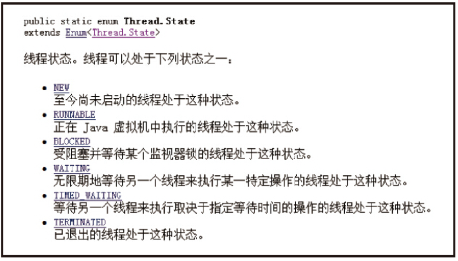
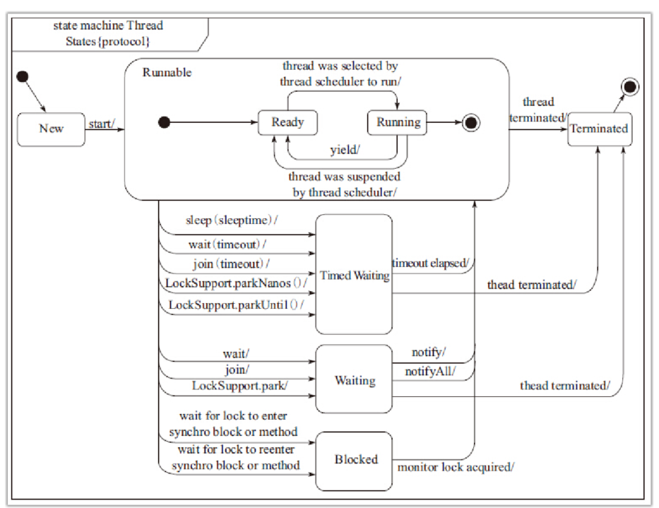
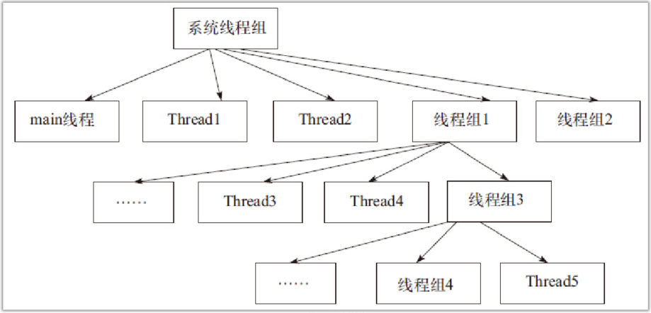

## 拾遗增补

应该掌握如下知识点：

- 线程组的使用
- 如何切换线程状态
- SimpleDataFormat类与多线程的解决办法
- 如何处理线程的异常

### 线程的状态

线程对象在不同的状态时期有不同的状态，状态信息就存在于State枚举类中。

方法与线程状态关系转换图

NEW状态是线程实例化后还从未执行start()方法时的状态；而RUNNABLE状态是线程进入运行的状态；TERMINATED是线程被销毁时的状态；TIMED_WAITING代表线程执行了Thread.sleep()、wait(long)、join(long)方法，呈等待状态；BLOCKED代表某一个线程在等待锁的时候；WAITING代表线程执行了Object.wait()方法后所处的状态。[示例1](state/Run.java) [示例2](state/Run2.java) [示例3](state/Run3.java)

### 线程组

可以把线程归属到某一个线程组中，线程组中可以有线程对象，也可以有线程组，组中还可以有线程。[示例1](threadGroup/Run.java) [示例2](threadGroup/Run2.java)

### 使线程具有有序性

多个线程按照顺序打印 [synchronized示例](orderly/Run.java)  [ReentrantLock示例](orderly/Run2.java)

### SimpleDateFormat非线程安全

类SimpleDateFormat主要负责日期的转换与格式化，但在多线程的环境中，使用此类容易造成数据转换及处理的不准确，因为SimpleDateFormat类并不是线程安全的。[示例](unsafeSimpleDateFormat/formatError/Test.java)

SimpleDateFormat多线程 解决方案

[示例1](unsafeSimpleDateFormat/formatOK01/Test.java) [示例2](unsafeSimpleDateFormat/formatOK02/Test.java)

#### 线程中出现异常的处理

#### 线程组内处理异常

需要注意的是，使用自定义的java.lang.ThreadGroup线程组，并且重写uncaughtException方法处理组内线程中断行为时，每个线程对象中的run()方法内部不要有异常catch语句，如果有catch语句，则public void uncaughtException(Thread t,Throwable e)方法不执行。

#### 线程异常处理的传递