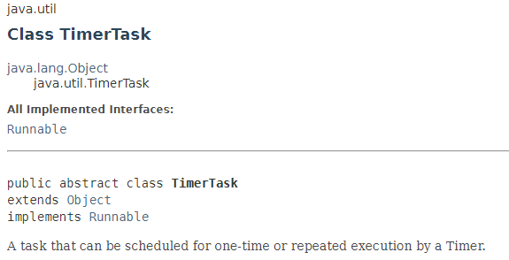

## 定时器Timer

Java中定时器主要使用的就是Timer对象，它在内部还是使用多线程的方式进行处理，所以它和线程技术有很大的关联。

应着重掌握的技术点：

- 如何实现指定时间内执行任务
- 如何实现按指定周期执行任务

### 定时器Timer的使用

Timer类主要负责计划任务功能，封装任务的类是TimerTask类。执行计划任务的代码要放入TimerTask的子类中，因为TimerTask是一个抽象类。


<center>TimerTask类相关的信息</center>




<center>Timer类的方法列表</center>

| 返回变量和类型 | 方法                                                         | 描述                                                         |
| -------------- | ------------------------------------------------------------ | ------------------------------------------------------------ |
| `void`         | `cancel()`                                                   | 将任务队列中全部的任务清空。Terminates this timer, discarding any currently scheduled tasks. |
| `void`         | `schedule(TimerTask task, Date time)`                        | Schedules the specified task for execution at the specified time. |
| `void`         | `schedule(TimerTask task, Date firstTime, long period)`      | Schedules the specified task for repeated *fixed-delay execution*, beginning at the specified time. |
| `void`         | `schedule(TimerTask task, long delay)`                       | Schedules the specified task for execution after the specified delay. |
| `void`         | `schedule(TimerTask task, long delay, long period)`          | Schedules the specified task for repeated *fixed-delay execution*, beginning after the specified delay. |
| `void`         | `scheduleAtFixedRate(TimerTask task, Date firstTime, long period)` | Schedules the specified task for repeated *fixed-rate execution*, beginning at the specified time. 在指定的日期之后按指定的间隔周期，无限循环地执行某一任务。 |
| `void`         | `scheduleAtFixedRate(TimerTask task, long delay, long period)` | Schedules the specified task for repeated *fixed-rate execution*, beginning after the specified delay. 补充性的追赶执行。 |


1、执行任务的时间晚于当前时间——在未来执行 [示例](timerTask01/Test1.java)

2、计划时间早于当前时间——提前运行 [示例](timerTask01/Test2.java)

3、周期性无限循环执行  [示例](timerTaskPeriod01/Run.java)

4、Timer中允许有多个TimerTask任务及 **延迟** [示例](timerTask02/Test1.java)

 ep:设置TimeTask1和TimeTask2的运行间隔时间为10s，由于task1需要用时20s执行完任务，所以task1结束时间就是task2的开始时间，不再以10s做为参考，究其原理还是因为Task是放入队列的，得一个一个执行。主要代码如下：

```java
class TimerThread extends Thread {
    ...
    private void mainLoop() {
            while (true) {
                try {
                    TimerTask task;
                    boolean taskFired;
                    synchronized(queue) {
                        // Wait for queue to become non-empty
                        while (queue.isEmpty() && newTasksMayBeScheduled)
                            queue.wait();
                        if (queue.isEmpty())
                            break; // Queue is empty and will forever remain; die

                        // Queue nonempty; look at first evt and do the right thing
                        long currentTime, executionTime;
                        task = queue.getMin();
                        synchronized(task.lock) {
                            if (task.state == TimerTask.CANCELLED) {
                                queue.removeMin();
                                continue;  // No action required, poll queue again
                            }
                            currentTime = System.currentTimeMillis();
                            executionTime = task.nextExecutionTime;
                            if (taskFired = (executionTime<=currentTime)) {
                                if (task.period == 0) { // Non-repeating, remove
                                    queue.removeMin();
                                    task.state = TimerTask.EXECUTED;
                                } else { // Repeating task, reschedule
                                    queue.rescheduleMin(
                                      task.period<0 ? currentTime   - task.period
                                                    : executionTime + task.period);
                                }
                            }
                        }
                        if (!taskFired) // Task hasn't yet fired; wait
                            queue.wait(executionTime - currentTime);
                    }
                    if (taskFired)  // Task fired; run it, holding no locks //这里是run()而不是start(),运行线程是同步的
                        task.run();
                } catch(InterruptedException e) {
                }
            }
        }
}
```

4、TimerTask类的cancel()方法是将自身从任务队列中进行清除，而Timer类中的cancel()方法作用是将任务队列中全部的任务进行清空，但是Timer类中的cancel()方法有时并不一定会停止任务计划，而是正常执行，因为cancel方法的执行需要争抢queue锁，如果争抢不到任务就正常执行了。

5、如果执行任务的时间没有被延时，则下一次执行任务的开始时间是上一次任务的开始时间加上period时间；如果执行任务的时间被延时，则下一次执行任务的开始时间是以上一次任务“结束”时的时间作为参考来计算。